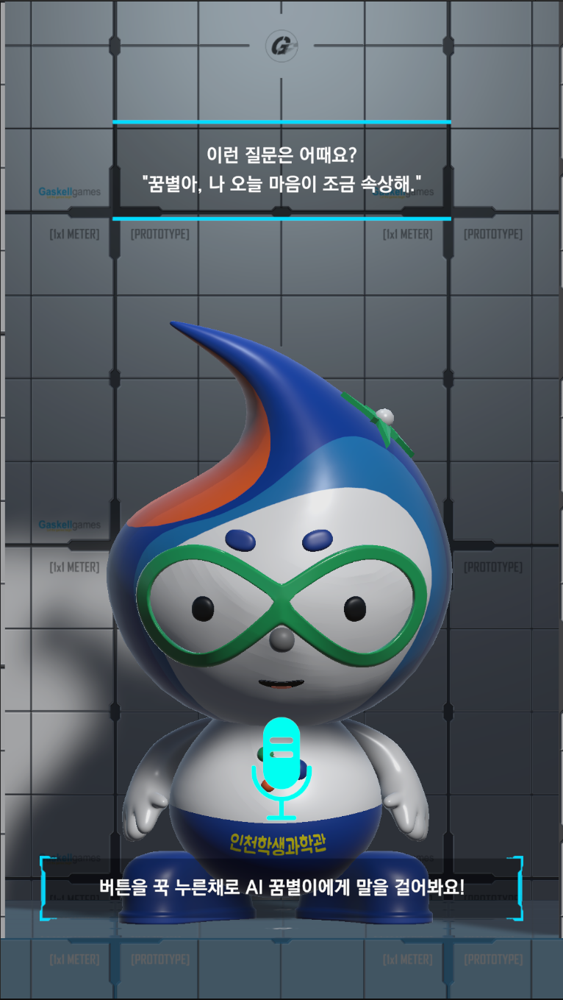

# 감정 AI 대화 키오스크

> 인천 학생과학관 체험 프로그램 — 음성으로 대화하면 AI가 감정을 분석하고 캐릭터가 공감 응답을 들려줍니다.



| 항목 | 내용 |
|------|------|
| 클라이언트 | 인천 학생과학관 |
| 플랫폼 | Windows PC (키오스크) |
| 엔진 | Unity (C#) |
| 설계 패턴 | PagingTemplate (FSM + MVP + 싱글톤) |
| 외부 API | Naver Clova STT/TTS, OpenAI GPT-4o-mini |
| 하드웨어 | 시리얼 통신 버튼 (SerialManager, config.csv로 ON/OFF 전환) |

**문서**: [기술 명세서](TECH_SPEC.md) · [포트폴리오 명세서](PORTFOLIO_SPEC.md)

---

## 화면 구성

| 홈 화면 |
|---------|
|  |

```
[HomeState] ←─ 단일 화면에서 모든 흐름 처리
    │  시리얼 버튼 누름 (data[1]==1) 또는 Space바 누름
    │  → 마이크 이펙트 + 음성 녹음
    │  버튼 땜 (data[1]==0) 또는 Space바 뗌
    │  → 로딩 애니메이션 → API 호출 → 캐릭터 애니메이션 + TTS 재생
    │  → 대기 상태로 자동 복귀 (_OnReset)
    └── (60초 무입력 시 IdleManager가 홈으로 리셋)
```

| UI 요소 | 역할 |
|---------|------|
| TxtMsgTop | 예시 질문 표시 (랜덤 5종) |
| TxtMsgBottom | 상태 안내 메시지 |
| MicEffectAnimator | 녹음 중 마이크 이펙트 애니메이션 |
| LoadingAnimator | API 처리 중 로딩 회전 애니메이션 |
| CharacterAnimator | 감정별 캐릭터 반응 애니메이션 |

---

## 핵심 기능

| 기능 | 설명 |
|------|------|
| 시리얼 버튼 입력 | SerialManager로 하드웨어 버튼 수신 → 녹음 시작/종료 제어 (config.csv `bUseSerial`로 활성화/비활성화), Space바로 에뮬레이션 가능 |
| 음성 녹음 | 마이크 48kHz 모노 캡처, 자동 게인 보정 (목표 0.35, 최대 150배), 1초 타임아웃 |
| STT | Naver Clova Speech — 한국어 음성→텍스트 변환 (30초 타임아웃) |
| 감정 분석 | OpenAI GPT-4o-mini — 5종 감정 분류 + 20자 내외 공감 응답 생성 (30초 타임아웃) |
| TTS | Naver Clova Voice Premium — 감정별 음성 합성, 화자: nara (30초 타임아웃) |
| 캐릭터 반응 | 감정 코드별 애니메이션 트리거 (tHappy/tSad/tAngry/tSurprised), 실패 시 tRefuse |
| 랜덤 예시 질문 | 초기/복귀 시 5종 예시 질문 중 랜덤 표시 |
| 유휴 감지 | 60초 무입력 시 자동 홈 복귀 |

---

## 아키텍처

PagingTemplate 네임스페이스 기반 FSM + MVP + 싱글톤 패턴

| 레이어 | 역할 | 주요 클래스 |
|--------|------|------------|
| **AI** | 외부 API 직접 호출 (STT→감정분석→TTS) + 녹음/재생 | `AIService`, `VoiceEmotionAnalyzer`, `VoiceProcessResponse` |
| **FSM** | 상태 전환 관리, 이벤트 구독 및 UI/애니메이션 제어 | `StateMachine`, `IState`, `BaseState<TState, TView>`, `HomeState` |
| **View** | UI 패널 표시/숨김, Inspector 필드 노출 | `BaseView`, `HomeView` |
| **Model** | CSV 기반 데이터 로딩 및 View별 매핑 | `DataRepository`, `PageData` |
| **Manager** | 싱글톤 시스템 관리 | `NavigationManager`, `IdleManager` |
| **Utility** | 싱글톤 베이스, CSV 파서, 시리얼 통신 | `MonoSingleton<T>`, `CSVParser`, `SerialManager` |

---

## 디렉토리 구조

```
Assets/
├── Scripts/
│   ├── AI/
│   │   ├── AIService.cs                # 외부 API 직접 호출 (Clova STT, OpenAI, Clova TTS)
│   │   └── VoiceEmotionAnalyzer.cs     # 마이크 녹음, 오디오 처리, 파이프라인 오케스트레이션
│   ├── FSM/
│   │   ├── IState.cs                   # 상태 인터페이스
│   │   ├── BaseState.cs               # 제네릭 상태 베이스 (MVP Presenter)
│   │   ├── StateMachine.cs            # 상태 등록/전환 엔진
│   │   └── States/
│   │       └── HomeState.cs           # 홈 화면 상태 (이벤트 바인딩, 시리얼 수신)
│   ├── View/
│   │   ├── BaseView.cs                # View 추상 베이스 (Show/Hide/네비 버튼)
│   │   └── HomeView.cs               # 홈 화면 View (AI, 애니메이터, UI 필드)
│   ├── Model/
│   │   ├── PageData.cs                # View별 key-value 데이터 컨테이너
│   │   └── DataRepository.cs         # DataConfig.json → CSV → PageData 변환
│   ├── Manager/
│   │   ├── NavigationManager.cs       # FSM 총괄 싱글톤
│   │   └── IdleManager.cs            # 무입력 타임아웃 감지
│   └── Util/
│       ├── MonoSingleton.cs           # 제네릭 싱글톤 베이스
│       ├── SerialManager.cs           # 시리얼 포트 통신 (config.csv로 ON/OFF)
│       └── CSVParser.cs              # StreamingAssets CSV 로더
├── Scenes/
│   ├── PagingTemplate.unity           # 메인 씬
│   └── GuideKioskTemplate.unity       # 가이드 키오스크 템플릿
└── StreamingAssets/
    ├── config.csv                     # 런타임 설정 (API 키, 시리얼 포트, 시리얼 사용 여부)
    └── DataConfig.json                # View↔CSV 매핑 설정
```

---

## 데이터 흐름

```
1. 시리얼 버튼 누름 (data[1]==1)
      ↓
2. VoiceEmotionAnalyzer.StartRecording()
   마이크 캡처 (48kHz 모노) → 자동 게인 보정 → WAV 16-bit PCM
      ↓
3. 버튼 땜 (data[1]==0) → StopRecordingAndProcess()
   AIService.ProcessVoice() — C#에서 외부 API 직접 호출
   Clova STT → GPT-4o-mini 감정분석 → Clova TTS
      ↓
4. VoiceProcessResponse 수신 → 캐릭터 애니메이션 + TTS MP3 재생 → _OnReset
```

**이벤트 흐름:**

```
_OnRecordingStarted              ← 녹음 시작 (UI 안내 표시)
_OnRecordingStopped              ← 녹음 중지 (로딩 애니메이션 시작)
  ├─ _OnRecordingFailed          ← 녹음 실패 → _OnReset
  └─ API 호출
       ├─ _OnProcessFailed       ← API/TTS 실패 → tRefuse 애니메이션 → _OnReset
       └─ _OnProcessComplete     ← API 성공 → 감정 애니메이션 트리거
            └─ _OnAudioPlayComplete  ← TTS 재생 완료 → _OnReset
```

**감정 코드 매핑:**

| 코드 | 감정 | 애니메이션 트리거 | Clova TTS 감정 |
|------|------|------------------|---------------|
| 0 | 중립 | — | 0 (중립) |
| 1 | 기쁨 | `tHappy` | 2 (기쁨) |
| 2 | 슬픔 | `tSad` | 1 (슬픔) |
| 3 | 화남 | `tAngry` | 3 (분노) |
| 4 | 놀람 | `tSurprised` | 2 (기쁨) |

**config.csv 설정:**

| key | 용도 | 예시 값 |
|-----|------|---------|
| `OpenAIApiKey` | OpenAI GPT-4o-mini 감정 분석 API 키 | 발급받은 OpenAI API 키 입력 |
| `NaverClientId` | Naver Clova STT/TTS 클라이언트 ID | 발급받은 Naver Cloud 클라이언트 ID 입력 |
| `NaverClientSecret` | Naver Clova STT/TTS 클라이언트 시크릿 | 발급받은 Naver Cloud 클라이언트 시크릿 입력 |
| `SerialPort` | 마이크 입력 버튼 연결 시리얼 포트 이름 | `COM3` |
| `bUseSerial` | 시리얼 통신 사용 여부 (`true`/`false`). `false` 시 포트 연결을 건너뜀 | `true` |

---

## 변경 이력

| 날짜 | 내용 |
|------|------|
| 2026-03-25 | config.csv에 bUseSerial 설정 추가 — 시리얼 통신 ON/OFF 전환 지원 |
| 2026-03-24 | 시리얼 통신 버튼 입력 연동, 캐릭터/마이크/로딩 애니메이션 제어, TTS 실패 처리 추가 |
| 2026-03-24 | _OnReset 이벤트 추가 — 실패/재생 완료 시 초기 상태 복귀 통합 이벤트 |
| 2026-03-23 | 이벤트 구조 개선 — _OnProcessFailed/_OnRecordingFailed 분리, 마이크 타임아웃 추가 |
| 2026-03-23 | Python 서버 제거 → C# 단일 구조 전환 (AIService에서 외부 API 직접 호출, 30초 타임아웃 적용) |
| 2026-03-23 | 감정 코드 0(중립) 추가, 놀람 TTS 감정을 기쁨으로 변경 |
| 2026-03-23 | PagingTemplate 구조로 전면 리팩토링 — FSM 페이징 구조 정리 및 단일 화면 전환 |
| 2026-03-16 | 전체 C# 소스 코드 정리 — 불필요 코드 제거, XML 주석 추가, 인코딩 오류 수정 |
| 2026-03-16 | README.md 초기 작성 |
